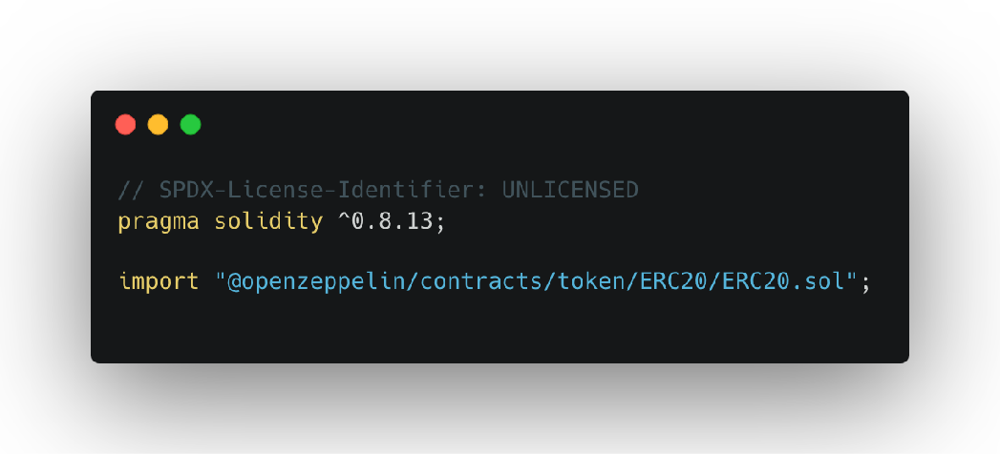

合约项目的创建和过程使用命令


### 初始化项目
``` 
forge init --template https://github.com/foundry-rs/forge-template 项目名称

```

### 合约编译

```
forge build
```

### 查看合约编译产物和元信息
```
forge inspect src/Counter.sol events
```

### 合约测试
```
forge test
```

```
forge test test/Counter.t.sol

```


### 安装 OpenZeppelin
```
forge install OpenZeppelin/openzeppelin-contracts
```

### 更新基础依赖
``` 
forge update OpenZeppelin/openzeppelin-contracts
```

### 移除依赖
```
forge remove openzeppelin-contracts
```

### 重新映射依赖项

```
forge remappings > remappings.txt

```



