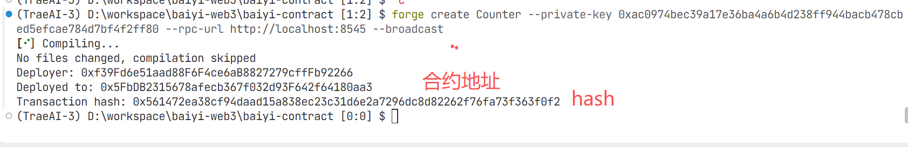

## 快速启动该项目
当我第一次看这个项目，我要怎么跑起来这个项目。。。。

###  1. 启动本地节点，模拟区块链

```
anvil
```

PS: —fork-url 基于网络的状态启动一个本地模拟环境

```
anvil --fork-url <RPC_RUL>
```


### 2. 编译合约

```
forge build
```

### 3. 部署合约

### 方式一

```
forge create Counter --private-key 0xac0974bec39a17e36ba4a6b4d238ff944bacb478cbed5efcae784d7bf4f2ff80 --rpc-url http://localhost:8545 --broadcast
```

部署后的产物


### 方式二 forge script 执⾏脚本⽂件来部署合约

```
forge script script/Counter.s.sol --private-key 0xac0974bec39a17e36ba4a6b4d238ff944bacb478cbed5efcae784d7bf4f2ff80 --rpc-url http://localhost:8545 --broadcast
```

### 方式三 keystore 账号部署
```
forge create Counter --account <ACCOUNT_NAME> --rpc-url http://localhost:8545 --broadcast

forge script script/Counter.s.sol --account <ACCOUNT_NAME> --rpc-url http://localhost:8545 --broadcast

forge create Counter --keystore ./.keystores/wallet1 --rpc-url http://localhost:8545 --broadcast

```

### 方式四 用 Solidity 脚本读取变量加载账号
```
forge script .\script\Counter_2.s.sol --rpc-url http://localhost:8545 --broadcast
```

### 方式五 优化rpc配置
在 `foundry.toml` 中配置 rpc 地址
```
[rpc_endpoints]
local = "http://localhost:8545"
```
```
forge script .\script\Counter_2.s.sol --rpc-url local --broadcast
```

作业
https://decert.me/challenge/7bd246d8-f0c3-45c0-a335-766505afdba9


